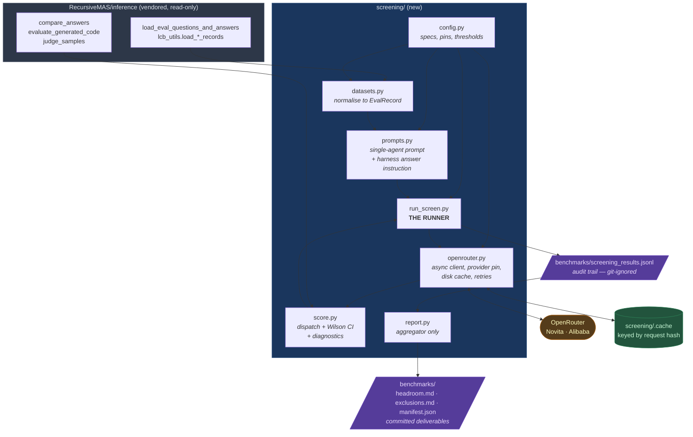
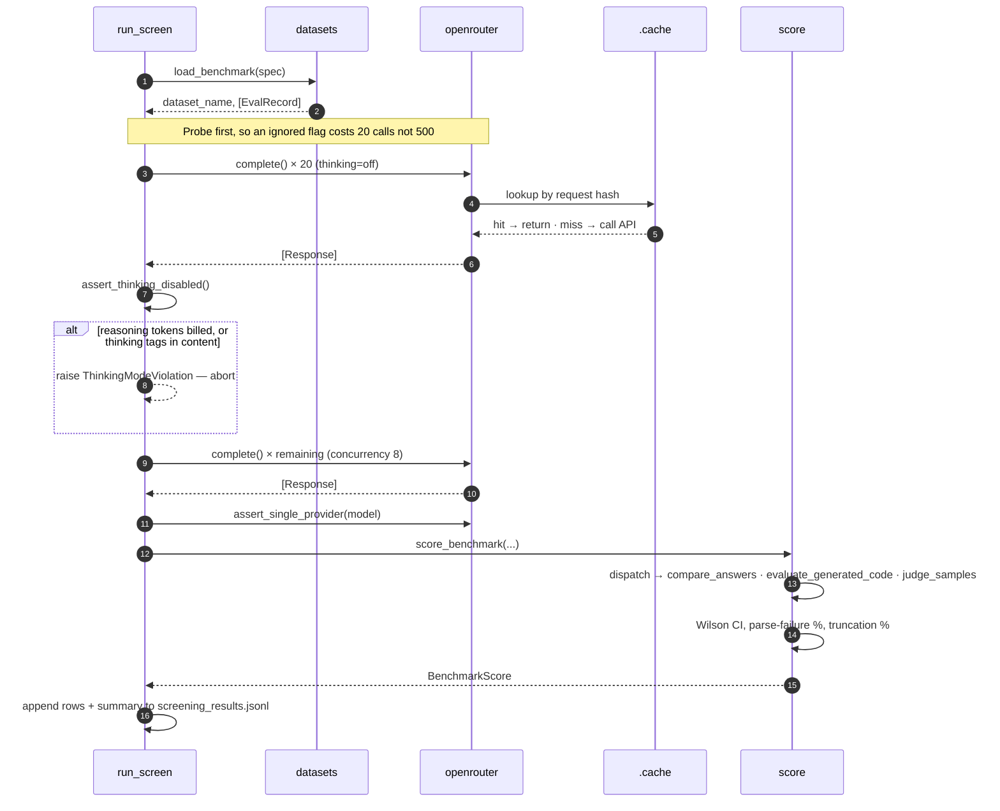
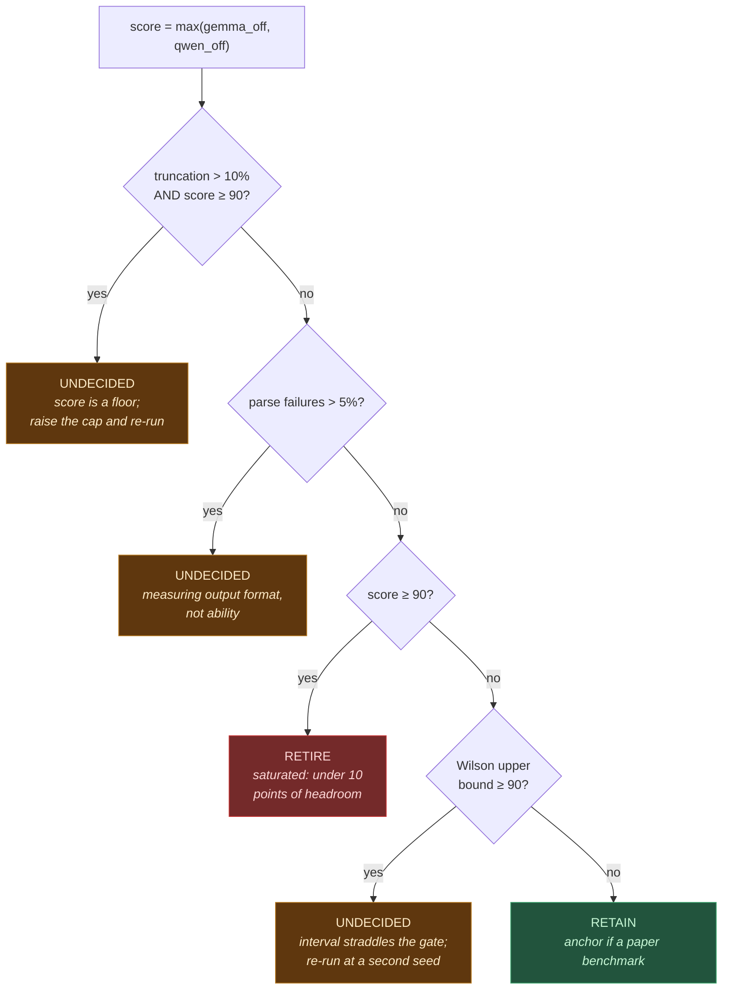

# Step 1 — Benchmark Screening: Design Decisions

**Status:** implemented, awaiting first live run
**Last updated:** 2026-08-30
**Code:** [`screening/`](../screening/) · **Outputs:** [`benchmarks/`](../benchmarks/)

---

## 1. What this step does

Step 1 measures how much **headroom** each candidate benchmark still has above our
untrained backbones, and retires the ones that have too little.

The motivation is a hard constraint on the rest of the project. Vendor-reported figures
for our chosen backbones sit far above what RecursiveMAS's best published system
achieves:

| | RecursiveMAS (published) | Gemma 4 31B | Qwen3.8-27B |
|---|---|---|---|
| GPQA-Diamond | 66.2 | 84.3 | 89.2 |
| LiveCodeBench-v6 | 42.9 | 80.0 | 90.3 |
| AIME2026 | 86.7 | 89.2 | — |

Those vendor figures are reported with reasoning enabled and under the vendors' own
prompting, so they are an upper bound rather than a prediction of what this screen will
measure. They are nonetheless sufficient to establish the risk: if a single unmodified
backbone already outperforms the full recursive system, that benchmark cannot answer
Research Question 1. There is no room above the floor for the architecture to demonstrate
anything, and evaluating it would consume weeks of node-hours to produce an
uninterpretable table.

Screening therefore runs both backbones, unmodified and unadapted, across every
candidate benchmark **through the paper's own evaluation harness** — but driven by
OpenRouter rather than local weights — and applies a saturation gate before any
compute is committed.

**Deliverable:** a locked list of retained benchmarks with recorded headroom, a written
justification for every exclusion, and a reproducibility manifest.

**Stop rule:** if fewer than four benchmarks survive, the project pauses. Benchmark
construction then becomes a research task in its own right and must be scoped
separately.

---

## 2. Design decisions

Each decision is recorded with the reasoning behind it, so that the write-up can
defend the screening protocol and so that a reader months from now can tell which
choices were deliberate.

### 2.1 Scope: seven of the paper's nine benchmarks

The project is scoped to the **Sequential Style** collaboration pattern only. The
harness's `RELEASE_RECOMMENDED_SETTINGS` table sanctions exactly seven datasets for
`sequential_scaled`: `math500`, `medqa`, `gpqa`, `mbppplus`, `aime25`, `aime26`, `lcb`.

`hotpotqa` and `bamboogle` appear **only** under `deliberation`, and
`run.py:validate_style_dataset` rejects them for every other style — without tools
they degrade to string matching and report a figure that does not reflect the task.
Sequential Style is Planner → Critic → Solver with no Tool-Caller agent, so it cannot
perform retrieval at all, and the paper publishes no Sequential-Scaled figure for
either benchmark against which a result could be compared.

Screening them would therefore measure headroom on benchmarks the system under study
can never run. They are recorded in `exclusions.md` as **scope** exclusions, kept
distinct from saturation exclusions.

> **Consequence.** The *search* domain drops out of the study, leaving mathematics,
> science, medicine and code. This follows directly from the Sequential-only scope and
> must be stated as such in the write-up, not presented as an unexplained omission.

A useful side effect: the two excluded benchmarks were the only ones requiring a
third-party search API, so screening now depends on OpenRouter and HuggingFace alone.

### 2.2 Reuse the vendored harness rather than reimplementing it

**Decision.** `screening/` imports the dataset loaders and scorers from
`RecursiveMAS/inference/` and never modifies that directory, which is a vendored
upstream checkout carrying its own `.git`.

**Rationale.** Those loaders encode paper-specific choices — GPQA option shuffling via
a stable hash, MedQA option formatting, MBPP+ prompt-test selection, LiveCodeBench
release-file concatenation — and the scorers encode a specific answer-extraction
cascade. Reimplementing either would silently place our scores on a different scale
from the published table, which is precisely the comparison the gate depends on. The
only new loading code is HLE, which the paper does not use.

### 2.3 Both thinking modes, with thinking-OFF as the gate

**Decision.** Every cell is run twice, with reasoning disabled and enabled. The
exclusion gate reads the **thinking-OFF** score; the thinking-ON score is recorded as
context but does not gate.

**Rationale.** The paper's harness runs with `--enable_thinking 0`, and the recursive
system under test has no separate reasoning budget. Granting the baseline one it does
not grant the system would be an unfair comparison that inflates the apparent
saturation. The thinking-ON column is retained because it is what vendor figures
report, and the write-up needs to state the ceiling under both regimes.

### 2.4 `reasoning.enabled = false`, never `reasoning.exclude = true`

**Decision.** The thinking-OFF arm sends `{"reasoning": {"enabled": false}}`. The
`exclude` variant is prohibited.

**Rationale.** OpenRouter's `exclude` flag suppresses reasoning tokens from the
*response* but still generates and still bills them. Using it would produce a
"thinking-OFF" column that was silently thinking-ON, at roughly double the cost, and
would invert every exclusion decision built on it.

**Enforcement.** Before the remainder of a benchmark proceeds, the first 20 responses
of every OFF cell are checked on three independent signals:

1. `choices[0].message.reasoning` is absent or empty;
2. `usage.completion_tokens_details.reasoning_tokens` is zero;
3. no `<think>` / `<thinking>` / `<reasoning>` block appears in the content.

Any violation raises `ThinkingModeViolation` and aborts. This is the single
highest-value assertion in the pipeline: a provider quietly ignoring the flag is
otherwise undetectable and would corrupt the entire screen.

### 2.5 Providers are pinned, not routed

**Decision.** Each model is pinned to one provider with `allow_fallbacks: false`. After
every cell, `assert_routing` checks two facts: that the served model id matches the one
requested, and that a single provider served the whole cell. Both are also written into
`manifest.json` as `models_served` and `providers_observed`, so the claim is checkable
after the fact rather than only asserted at runtime.

| Model | Pin | Quantisation | Reasoning |
|---|---|---|---|
| `google/gemma-4-31b-it` | Novita | bf16 | Most bf16 Gemma endpoints cap completions at 8,192 tokens, below AIME's 16,000 requirement. Novita is the only bf16 endpoint with sufficient headroom (131,072 max completion, 262K context). |
| `qwen/qwen3.8-27b` | Alibaba (first-party) | fp8 or undeclared | **No OpenRouter provider declares bf16 for this model.** Alibaba is the model author and the closest available proxy (1M context, 131,072 max completion). |

**Rationale.** OpenRouter load-balances across providers serving different
quantisations. A score averaged over mixed weights is attributable to no specific
model, which is exactly the objection Step 7 raises against using API figures as
baselines. For a threshold decision this is tolerable, but only with the provider
fixed and recorded.

**On Qwen's precision.** fp8 typically costs 0–2 points on reasoning benchmarks, well
inside the ten-point band the gate cares about, and the bias runs *downwards* — so the
only error it can induce is *retaining* a benchmark that should have been retired.
That is recoverable; wrongly retiring one is not. A one-off spot-check should
nonetheless be run: GPQA-Diamond on Qwen3.8-27B locally at bf16 via vLLM (~20 minutes
of node time), diffed against the fp8 API score and recorded in `manifest.json`.

### 2.6 Saturation threshold of 90, not 80

**Decision.** A benchmark is retired when the strongest backbone scores **≥ 90** with
thinking disabled — fewer than ten points of headroom.

**Rationale.** An initial proposal of 80 was relaxed to match the project overview's
own rule ("retire any benchmark where headroom falls below roughly ten points"). At
the stricter threshold, vendor figures suggest all nine original benchmarks would have
been retired, which would have triggered the stop rule and left no continuity anchors
for partial comparison with published results.

### 2.7 Wilson intervals, and a fourth verdict for borderline cases

**Decision.** Every score carries a Wilson 95% confidence interval. Where the point
estimate falls below 90 but the interval's upper bound crosses it, the benchmark is
marked `UNDECIDED` and is **not** locked.

**Rationale.** The Wilson interval is better behaved than the normal approximation near
0 and 100, which is exactly where the gate sits. Treating a borderline result as a
clean decision would lock a benchmark list on evidence that does not support it.

### 2.8 Parse-failure and truncation are first-class diagnostics

Two properties of the harness can produce a number that looks like a measurement but
is not. Both are recorded per benchmark and both can force an `UNDECIDED` verdict.

**The `default="A"` fallback.** `answer_utils.compare_answers` scores an unparseable
multiple-choice prediction as `"A"` rather than as wrong, returning roughly 25% of
unparsed items as free credit. With thinking disabled a model may stop emitting
`\boxed{}` reliably, and GPQA or MedQA accuracy would be inflated by chance. A
parse-failure rate above 5% therefore blocks a decision.

**Truncation.** A high rate of `finish_reason == "length"` means the token cap bound
the score rather than the model's ability. Such a score is a *floor*, and retiring a
benchmark on it would discard it on evidence that cannot support the conclusion.

### 2.9 Full sets at the paper's protocol, accepting a cost overrun

**Decision.** Every benchmark runs at its complete size with the paper's decoding
settings, including AIME pass@10 (300 generations per benchmark) and the full
LiveCodeBench set.

**Cost.** Approximately **$136** — $97 generation plus $39 for the LLM judge — against
the project overview's $30 line. The overrun is a deliberate, recorded choice, driven
by running both thinking modes at full scale. It buys figures directly comparable to
the published table and confidence intervals tight enough to decide borderline cases
without re-runs.

### 2.10 Generation and scoring are separately invocable

**Decision.** Generation is cached to disk, keyed on
`sha256(model, provider, prompt, parameters, rollout_index)`. Scoring runs
independently and can be repeated for free via `--rescore-only`.

**Rationale.** Generation is slow, network-bound and expensive; scoring is fast, local,
and the half that will be iterated on. A scorer bug should never cost a $136 re-run,
and an interrupted sweep should resume rather than restart.

### 2.11 Replacement candidates: HLE only

Of the four candidates named in the project overview, three cannot be screened:

| Candidate | Verdict | Reason |
|---|---|---|
| **HLE** | Screened | Public (gated, instant approval), text-only subset works as plain Q&A, graded by the existing LLM judge |
| FrontierMath | Not screened | 12 of 338 problems are public; the remainder is held privately by Epoch AI, with OpenAI holding exclusive access to a subset |
| Agents' Last Exam | Not screened | Computer-use agent tasks, reference outputs gated behind manual approval, sub-1% pass rate. Sequential Style has no computer-use loop, and a 1% floor carries no signal either |
| SWE-Bench Verified | Not screened | Requires Docker, repository checkouts and an agentic edit/test loop that Sequential Style cannot express; screening a bare model would measure the scaffold, not the backbone |

A reserve pool — HMMT Feb 2026, MedXpertQA (Text), SciCode — is held for screening on
demand should the survivor count fall short or a domain be eliminated entirely.

### 2.12 One key, not two

**Decision.** `.env` requires only `OPENROUTER_API_KEY` and `HF_TOKEN`. The judge's
`API_KEY` / `API_BASE_URL` / `API_MODEL` are populated by `config.py` via `setdefault`.

**Rationale.** `llm_judge.require_config()` reads those three names from the environment
and they are fixed in the vendored module, which cannot be edited. Requiring the user to
paste the same OpenRouter key under a second name would be a needless source of
copy-paste error and of drift between the two values. `setdefault` preserves the escape
hatch: an explicitly set value still wins, which is how the judge would be pointed at a
different provider. The resolved judge model is recorded in `manifest.json`, since it
determines every HLE score.

### 2.13 Licence compliance is enforced by `.gitignore`

GPQA-Diamond and HLE are both gated on an agreement not to publish their contents, so
as to keep them out of foundation-model training corpora. `screening_results.jsonl`
contains every question and gold answer in plain text and is therefore git-ignored —
a rule that now performs licence-compliance work, not merely size management.
Aggregate scores are safe to publish; the per-sample rows are not.

---

## 3. How it has been implemented

### 3.1 Architecture

`screening/` is a standalone package that imports from the vendored harness and never
writes to it. The unit of work is a **cell**: one (benchmark, model, thinking mode)
triple. The full sweep is 8 × 2 × 2 = **32 cells**.



### 3.2 Execution of a single cell



For AIME the cell repeats across ten rollouts, each seeded `seed + rollout_index` so
samples differ, and the metric becomes pass@10 — an item counts as solved if any
rollout solved it.

### 3.3 The gate

Applied by `report.py` once results are on disk. Order matters: the two integrity
checks precede the saturation test, so a benchmark is never retired on an untrustworthy
score.



### 3.4 Benchmarks screened

Generation caps and temperatures mirror `run.py:infer_max_new_tokens` and
`infer_temperature` exactly.

| Benchmark | Source | n | Scorer | Temp. | Max tokens | Rollouts |
|---|---|---|---|---|---|---|
| MATH500 | `HuggingFaceH4/MATH-500` | 500 | math | 0.6 | 2,000 | 1 |
| GPQA-Diamond | `Idavidrein/gpqa` (gated) | 198 | choice | 0.6 | 4,000 | 1 |
| MedQA | local `dataset/medqa.json` | 300 | choice | 0.6 | 4,000 | 1 |
| MBPP+ | `evalplus/mbppplus` | 378 | code | 0.2 | 4,000 | 1 |
| AIME2025 | `math-ai/aime25` | 30 | math | 0.6 | 16,000 | 10 |
| AIME2026 | `MathArena/aime_2026` | 30 | math | 0.6 | 16,000 | 10 |
| LiveCodeBench | `livecodebench/code_generation_lite` | ~1,055 | code | 0.2 | 4,096 | 1 |
| HLE (text-only) | `cais/hle` (gated) | ~2,158 | judge | 0.6 | 4,000 | 1 |

`top_p = 0.95` and `seed = 42` throughout.

Two provenance notes for the write-up: MedQA is the 300-item local subset shipped with
the harness, not the full 1,273-item test set; and the LiveCodeBench loader
concatenates all six release files, giving the cumulative v1–v6 lite set rather than
the v6 window alone. Both match what the paper scored.

---

## 4. What each file does

### `screening/`

| File | Responsibility |
|---|---|
| `config.py` | Single source of truth. Benchmark specs, model specs and provider pins, thinking-mode payloads, the saturation threshold, out-of-scope and infeasible benchmark registries, and `.env` loading that fails loudly listing every missing key. Also injects the vendored harness onto `sys.path` and sets `MAS_FORCE_DISABLE_TORCHVISION`. |
| `datasets.py` | Delegates to the vendored loaders and normalises every benchmark to a common `EvalRecord` (`idx`, `question`, `gold`, `dataset_name`, `meta`). Contains the only new loading code: the HLE text-only subset, which discards items carrying images. |
| `prompts.py` | Builds the single-agent prompt. The multi-agent role framing is dropped, but the **final-answer instructions are lifted verbatim** from `prompts.py` in the harness, because extraction depends on them. Reproduces the distinction whereby GPQA receives the terse `choice_old_prompt=2` wording and other choice datasets receive the default. |
| `openrouter.py` | Async client with bounded concurrency, exponential back-off on 429/5xx, atomic disk caching, and per-model routing tracking. Hosts `assert_thinking_disabled` and `assert_routing`. |
| `score.py` | Dispatches to the vendored scorers by task type, computes Wilson intervals, and derives the parse-failure and truncation diagnostics that the harness does not report. Handles pass@k aggregation. |
| `run_screen.py` | **The runner.** CLI, cell selection, rollout orchestration, the thinking probe, cost estimation, and writing the audit trail. |
| `report.py` | **Aggregator only — never calls the API.** Reads the audit trail, applies the gate, and writes the three committed deliverables. |
| `requirements.txt` | Screening dependencies, pinned and verified on Python 3.14.6. Deliberately *not* `RecursiveMAS/requirements.txt`, which pins the GPU training stack. |

### Repository root

| File | Responsibility |
|---|---|
| `.gitignore` | Excludes `.env`, the response cache, and `benchmarks/*.jsonl`. The last of these is a licence-compliance control (§2.12), not merely size management. |
| `.env.example` | Committed template. Two required secrets — `OPENROUTER_API_KEY` and `HF_TOKEN` — plus three commented-out judge overrides. Documents both gated-dataset URLs and the fine-grained-token permission required. |
| `.env` | Git-ignored. Never pass keys on the command line — they persist in shell history. |

### `benchmarks/` — outputs

| File | Purpose | Committed |
|---|---|---|
| `headroom.md` | The locked benchmark list. Steps 2 and 8 read it to determine what to run, and it enters the write-up's methods section largely unchanged. | Yes |
| `exclusions.md` | A written justification per exclusion, covering saturated, out-of-scope and infeasible benchmarks. Required by Step 1's success criteria; written at screening time so that no exclusion rests on retrospective reasoning. | Yes |
| `manifest.json` | Model IDs, provider pins and observed providers, seeds, decoding settings and realised cost. Without it, a quoted score is unfalsifiable. | Yes |
| `screening_results.jsonl` | Per-sample audit trail, enabling re-scoring without regeneration and item-level diagnosis. | **No** — see §2.12 |

---

## 5. How to run it

### 5.1 Prerequisites

All free apart from OpenRouter credit.

1. **OpenRouter account** with credit — the only monetary cost. One key serves both
   generation and the LLM judge; `config.py` derives the judge's settings from it,
   so the key is never entered twice.
2. **HuggingFace account and read token** — [huggingface.co/settings/tokens](https://huggingface.co/settings/tokens).
   A fine-grained token requires *"Read access to contents of all public gated repos
   you can access"* to be ticked explicitly; a classic read token works unmodified.
3. **Accept both gated-dataset agreements** — approval is instantaneous:
   - [`Idavidrein/gpqa`](https://huggingface.co/datasets/Idavidrein/gpqa)
   - [`cais/hle`](https://huggingface.co/datasets/cais/hle)

Accept both *before* the canary, since it touches every benchmark.

### 5.2 Environment

```bash
cd ~/Desktop/RecursiveMAS_MK2

python3 -m venv .venv && source .venv/bin/activate
pip install -r screening/requirements.txt
pip install torch==2.13.0 --index-url https://download.pytorch.org/whl/cpu

cp .env.example .env    # then populate it
```

CPU-only torch is deliberate. `answer_utils.py` imports torch at module scope for
`format_latent_info`, which screening never calls, so the import must merely resolve —
roughly 200 MB rather than 2.5 GB, and nothing in Step 1 touches a GPU.

### 5.3 Running

```bash
# 1. Estimate cost without spending anything.
python -m screening.run_screen --all --dry-run          # ≈ $136

# 2. Canary: every cell at 10 samples, 2 rollouts, 2,000-token cap.
#    Exercises every path — loaders, prompts, the thinking probe, the code
#    sandbox and the judge — for under a dollar.
python -m screening.run_screen --canary                 # ≈ $0.93

# 3. Full sweep. Resumable: re-running skips anything already cached.
python -m screening.run_screen --all

# 4. Aggregate into the deliverables. Free, repeatable.
python -m screening.report

# 5. Re-score cached responses after a scorer change — no API spend.
python -m screening.run_screen --all --rescore-only
```

Single cells, for debugging or a targeted re-run:

```bash
python -m screening.run_screen --benchmark gpqa --model qwen --thinking off
```

| Flag | Effect |
|---|---|
| `--benchmark` / `--model` / `--thinking` | Restrict the sweep; each defaults to all |
| `--num-samples N` | Cap items per benchmark |
| `--seed` | Defaults to 42 |
| `--concurrency` | In-flight requests, default 8 |
| `--dry-run` | Print the cost estimate and exit |
| `--no-cache` | Force regeneration |
| `--rescore-only` | Re-score cached responses; a cache miss is an error |

A bare invocation is rejected deliberately, so that a mistyped command cannot start a
$136 sweep.

### 5.4 Expected duration and failure modes

The full sweep takes several hours at concurrency 8, dominated by AIME (600
generations at a 16,000-token cap) and LiveCodeBench (~1,055 items). It is resumable,
so interruption is safe.

| Symptom | Cause | Remedy |
|---|---|---|
| `ThinkingModeViolation` during the probe | The pinned provider ignores `reasoning.enabled=false` | Do not proceed. Re-pin to another provider and re-probe; the OFF column is invalid otherwise |
| `RuntimeError: Provider changed mid-run` | A fallback occurred despite the pin | Verify `allow_fallbacks: false`; discard and re-run that model's cells |
| HTTP 401 on GPQA or HLE | Terms unaccepted, or a fine-grained token lacking gated-repo permission | Accept the terms; re-issue the token with the correct scope |
| `UNDECIDED` on a benchmark | Borderline interval, excessive truncation, or excessive parse failures | Follow the remedy stated in `exclusions.md` for that benchmark — a second seed, a raised cap, or a prompt adjustment |

### 5.5 Verification before locking the list

1. Confirm `.env` is absent from `git status` and that `git check-ignore` matches it.
2. Confirm the thinking probe passed for every OFF cell.
3. Confirm `manifest.json` records one provider per model.
4. Reconcile logged usage against the OpenRouter activity page.
5. Re-run GPQA-Diamond end to end at the same seed; a delta above ~2 points indicates
   the provider is not honouring `seed`, and every interval in the table is
   consequently understated.
6. Run the bf16 precision spot-check on the node (§2.5) and record the delta.

---

## 6. Open items

- **First live run outstanding.** Everything except the API calls has been verified
  offline: module imports, the MedQA loader, prompt construction for all three answer
  formats, Wilson intervals, parse detection, the code sandbox (pass / wrong-answer /
  timeout), the thinking-mode assertion on all three signals, per-model provider
  tracking, and the full score-to-report pipeline across every gate branch.
- **Loader parity for the seven network-backed benchmarks** is confirmed only at the
  canary stage. GPQA's stable-hash option shuffling in particular must reproduce the
  correct gold letters.
- **The bf16 precision spot-check** (§2.5) has not yet been run.
- **Reserve pool** remains unscreened, pending the survivor count.
